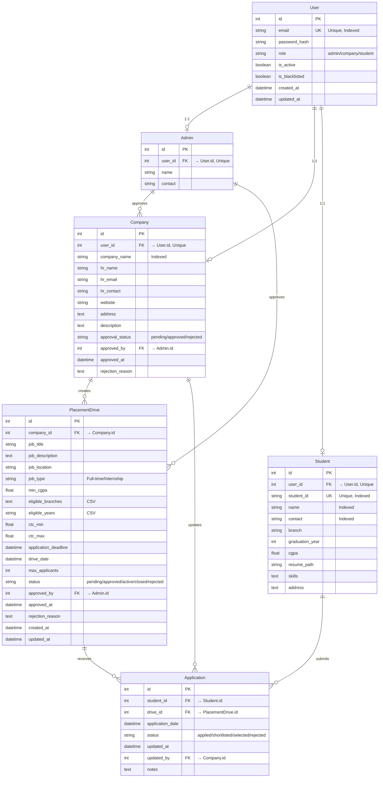

# Database Schema - Placement Portal Application

## Overview
This document contains the complete database schema for the Placement Portal Application with all models, fields, constraints, and relationships.

**Database**: SQLite  
**ORM**: SQLAlchemy (Flask-SQLAlchemy)  
**Total Tables**: 6

---

## Entity-Relationship Diagram



---

## Table Schemas

### 1. User (Base Authentication Table)

**Table Name**: `users`

| Column | Type | Constraints | Default | Description |
|--------|------|-------------|---------|-------------|
| `id` | Integer | PRIMARY KEY, AUTO INCREMENT | - | Unique identifier |
| `email` | String(120) | UNIQUE, NOT NULL | - | Login email |
| `password_hash` | String(256) | NOT NULL | - | Hashed password (pbkdf2:sha256) |
| `role` | String(20) | NOT NULL | - | Role discriminator: 'admin', 'company', 'student' |
| `is_active` | Boolean | NOT NULL | False | Account activation status |
| `is_blacklisted` | Boolean | NOT NULL | False | Blacklisted flag |
| `created_at` | DateTime | NOT NULL | CURRENT_TIMESTAMP | Registration timestamp |
| `updated_at` | DateTime | NOT NULL | CURRENT_TIMESTAMP | Last update timestamp |

**Indexes**:
- `idx_users_email` ON `email` (UNIQUE)
- `idx_users_role` ON `role`
- `idx_users_active_blacklist` ON `(is_active, is_blacklisted)`

**Relationships**:
- One-to-one with Admin
- One-to-one with Company
- One-to-one with Student

**Business Rules**:
- Email must be unique across all users
- Password must be hashed before storage
- Role determines which related table to join
- Blacklisted users cannot login

---

### 2. Admin (Institute Placement Cell)

**Table Name**: `admins`

| Column | Type | Constraints | Default | Description |
|--------|------|-------------|---------|-------------|
| `id` | Integer | PRIMARY KEY, AUTO INCREMENT | - | Unique identifier |
| `user_id` | Integer | FOREIGN KEY → users.id, UNIQUE, NOT NULL | - | Link to user account |
| `name` | String(100) | NOT NULL | - | Admin name |
| `contact` | String(20) | NULLABLE | - | Contact number |

**Foreign Keys**:
- `user_id` → `users.id` (CASCADE on DELETE)

**Relationships**:
- Belongs to one User
- Approves many Companies
- Approves many PlacementDrives

**Business Rules**:
- Pre-seeded in database initialization
- At least one admin must exist
- Admin accounts cannot be deleted (or soft delete only)

**Seed Data**:
```python
# Default admin credentials
email: admin@institute.edu
password: Admin@123 (hashed)
role: admin
is_active: True
```

---

### 3. Company

**Table Name**: `companies`

| Column | Type | Constraints | Default | Description |
|--------|------|-------------|---------|-------------|
| `id` | Integer | PRIMARY KEY, AUTO INCREMENT | - | Unique identifier |
| `user_id` | Integer | FOREIGN KEY → users.id, UNIQUE, NOT NULL | - | Link to user account |
| `company_name` | String(200) | NOT NULL | - | Company name |
| `hr_name` | String(100) | NOT NULL | - | HR contact person |
| `hr_email` | String(120) | NOT NULL | - | HR email |
| `hr_contact` | String(20) | NOT NULL | - | HR phone number |
| `website` | String(200) | NULLABLE | - | Company website |
| `address` | Text | NULLABLE | - | Company address |
| `description` | Text | NULLABLE | - | Company description |
| `approval_status` | String(20) | NOT NULL | 'pending' | Approval workflow status |
| `approved_by` | Integer | FOREIGN KEY → admins.id, NULLABLE | NULL | Admin who approved |
| `approved_at` | DateTime | NULLABLE | NULL | Approval timestamp |
| `rejection_reason` | Text | NULLABLE | NULL | Reason for rejection |

**Foreign Keys**:
- `user_id` → `users.id` (CASCADE on DELETE)
- `approved_by` → `admins.id` (SET NULL on DELETE)

**Indexes**:
- `idx_companies_name` ON `company_name`
- `idx_companies_approval` ON `approval_status`

**Relationships**:
- Belongs to one User
- Has many PlacementDrives
- Approved by one Admin (optional)
- Updates many Applications

**Enums**:
- `approval_status`: ['pending', 'approved', 'rejected']

**Business Rules**:
- Cannot login until `approval_status = 'approved'`
- When blacklisted: `user.is_blacklisted = True`, all active drives closed
- When deleted: CASCADE delete all drives and applications OR soft delete

**Status Transitions**:
```
pending → approved (by admin)
pending → rejected (by admin)
approved → (can be blacklisted)
```

---

### 4. Student

**Table Name**: `students`

| Column | Type | Constraints | Default | Description |
|--------|------|-------------|---------|-------------|
| `id` | Integer | PRIMARY KEY, AUTO INCREMENT | - | Unique identifier |
| `user_id` | Integer | FOREIGN KEY → users.id, UNIQUE, NOT NULL | - | Link to user account |
| `student_id` | String(50) | UNIQUE, NOT NULL | - | University/College ID |
| `name` | String(100) | NOT NULL | - | Student full name |
| `contact` | String(20) | NOT NULL | - | Phone number |
| `branch` | String(100) | NOT NULL | - | Engineering branch (CSE, ECE, etc.) |
| `graduation_year` | Integer | NOT NULL | - | Year of graduation (e.g., 2026) |
| `cgpa` | Float | NOT NULL | - | CGPA (0.0 to 10.0 scale) |
| `resume_path` | String(500) | NULLABLE | NULL | Path to uploaded resume file |
| `skills` | Text | NULLABLE | NULL | Comma-separated skills |
| `address` | Text | NULLABLE | NULL | Student address |

**Foreign Keys**:
- `user_id` → `users.id` (CASCADE on DELETE)

**Indexes**:
- `idx_students_student_id` ON `student_id` (UNIQUE)
- `idx_students_name` ON `name`
- `idx_students_contact` ON `contact`
- `idx_students_year_cgpa` ON `(graduation_year, cgpa)`

**Relationships**:
- Belongs to one User
- Has many Applications

**Constraints**:
- `student_id` must be unique
- `cgpa` must be between 0.0 and 10.0
- `graduation_year` must be valid (2020-2030 range)

**Business Rules**:
- Auto-approved on registration (`user.is_active = True`)
- Must upload resume before applying to drives
- Eligibility checked against drive criteria
- When blacklisted: cannot apply to new drives
- When deleted: CASCADE delete all applications OR soft delete

---

### 5. PlacementDrive (Job Postings)

**Table Name**: `placement_drives`

| Column | Type | Constraints | Default | Description |
|--------|------|-------------|---------|-------------|
| `id` | Integer | PRIMARY KEY, AUTO INCREMENT | - | Unique identifier |
| `company_id` | Integer | FOREIGN KEY → companies.id, NOT NULL | - | Company creating the drive |
| `job_title` | String(200) | NOT NULL | - | Job position title |
| `job_description` | Text | NOT NULL | - | Detailed job description |
| `job_location` | String(200) | NULLABLE | - | Job location (city) |
| `job_type` | String(50) | NULLABLE | - | Job type (Full-time/Internship) |
| `min_cgpa` | Float | NOT NULL | - | Minimum CGPA requirement |
| `eligible_branches` | Text | NOT NULL | - | CSV of eligible branches |
| `eligible_years` | String(50) | NOT NULL | - | CSV of eligible graduation years |
| `ctc_min` | Float | NULLABLE | NULL | Minimum CTC in lakhs |
| `ctc_max` | Float | NULLABLE | NULL | Maximum CTC in lakhs |
| `application_deadline` | DateTime | NOT NULL | - | Last date to apply |
| `drive_date` | DateTime | NULLABLE | NULL | Scheduled drive date |
| `max_applicants` | Integer | NULLABLE | NULL | Maximum applications allowed |
| `status` | String(20) | NOT NULL | 'pending' | Drive status |
| `approved_by` | Integer | FOREIGN KEY → admins.id, NULLABLE | NULL | Admin who approved |
| `approved_at` | DateTime | NULLABLE | NULL | Approval timestamp |
| `rejection_reason` | Text | NULLABLE | NULL | Reason for rejection |
| `created_at` | DateTime | NOT NULL | CURRENT_TIMESTAMP | Creation timestamp |
| `updated_at` | DateTime | NOT NULL | CURRENT_TIMESTAMP | Last update timestamp |

**Foreign Keys**:
- `company_id` → `companies.id` (CASCADE on DELETE)
- `approved_by` → `admins.id` (SET NULL on DELETE)

**Indexes**:
- `idx_drives_company` ON `company_id`
- `idx_drives_status` ON `status`
- `idx_drives_deadline` ON `application_deadline`
- `idx_drives_approved` ON `(status, approved_at)`

**Relationships**:
- Belongs to one Company
- Has many Applications
- Approved by one Admin (optional)

**Enums**:
- `status`: ['pending', 'approved', 'active', 'closed', 'rejected']
- `job_type`: ['Full-time', 'Internship']

**Business Rules**:
- Only approved companies can create drives
- Requires admin approval before visible to students
- Students can only view drives with status 'approved' or 'active'
- Automatically closes when deadline passes
- Cannot accept applications when status = 'closed'
- `application_deadline` must be in future at creation
- When company is deleted: CASCADE delete OR soft delete

**Status Transitions**:
```
pending → approved (by admin) → active → closed
pending → rejected (by admin)
active → closed (manual or deadline)
```

---

### 6. Application (Student-Drive Link)

**Table Name**: `applications`

| Column | Type | Constraints | Default | Description |
|--------|------|-------------|---------|-------------|
| `id` | Integer | PRIMARY KEY, AUTO INCREMENT | - | Unique identifier |
| `student_id` | Integer | FOREIGN KEY → students.id, NOT NULL | - | Student applying |
| `drive_id` | Integer | FOREIGN KEY → placement_drives.id, NOT NULL | - | Drive being applied to |
| `application_date` | DateTime | NOT NULL | CURRENT_TIMESTAMP | Application timestamp |
| `status` | String(20) | NOT NULL | 'applied' | Application status |
| `updated_at` | DateTime | NOT NULL | CURRENT_TIMESTAMP | Last status update |
| `updated_by` | Integer | FOREIGN KEY → companies.id, NULLABLE | NULL | Company user who updated |
| `notes` | Text | NULLABLE | NULL | Company notes/feedback |

**Foreign Keys**:
- `student_id` → `students.id` (CASCADE on DELETE)
- `drive_id` → `placement_drives.id` (CASCADE on DELETE)
- `updated_by` → `companies.id` (SET NULL on DELETE)

**Unique Constraints**:
- `unique_application` ON `(student_id, drive_id)` - **Prevents duplicate applications**

**Indexes**:
- `idx_applications_student` ON `student_id`
- `idx_applications_drive` ON `drive_id`
- `idx_applications_status` ON `status`
- `idx_applications_unique` ON `(student_id, drive_id)` (UNIQUE)

**Relationships**:
- Belongs to one Student
- Belongs to one PlacementDrive
- Updated by one Company (optional)

**Enums**:
- `status`: ['applied', 'shortlisted', 'selected', 'rejected']

**Business Rules**:
- **Duplicate Prevention**: One student can apply to one drive only once (enforced by unique constraint)
- Student must meet eligibility criteria:
  - CGPA >= drive.min_cgpa
  - Branch in drive.eligible_branches
  - Graduation year in drive.eligible_years
  - Resume must be uploaded
- Application deadline must not be passed at time of application
- Drive must be in 'approved' or 'active' status
- Student must not be blacklisted
- Only companies can update application status
- Status transitions must follow valid flow

**Status Transitions**:
```
applied → shortlisted (by company)
applied → rejected (by company)
shortlisted → selected (by company)
shortlisted → rejected (by company)
selected → [FINAL STATE]
rejected → [FINAL STATE]
```

**Invalid Transitions**:
```
applied → selected (must go through shortlisted)
selected → any (final state)
rejected → any (final state)
```

---

## Relationships Summary

### One-to-One Relationships
1. **User ←→ Admin**: One user account for one admin profile
2. **User ←→ Company**: One user account for one company profile
3. **User ←→ Student**: One user account for one student profile

### One-to-Many Relationships
1. **Company → PlacementDrive**: One company creates many placement drives
2. **PlacementDrive → Application**: One drive receives many applications
3. **Student → Application**: One student submits many applications
4. **Admin → Company** (approvals): One admin approves many companies
5. **Admin → PlacementDrive** (approvals): One admin approves many drives
6. **Company → Application** (updates): One company updates many applications

### Many-to-Many Relationships (through junction table)
- **Student ←→ PlacementDrive** through `Application` table

---

## Cascade Delete Behavior

### When User is deleted:
- CASCADE delete related Admin/Company/Student record
- CASCADE delete all applications (if Student)
- CASCADE delete all drives and applications (if Company)

### When Company is deleted:
- CASCADE delete all PlacementDrives
- CASCADE delete all Applications for those drives

### When Student is deleted:
- CASCADE delete all Applications

### When PlacementDrive is deleted:
- CASCADE delete all Applications

### When Admin is deleted:
- SET NULL on Company.approved_by
- SET NULL on PlacementDrive.approved_by

**Recommendation**: Use soft deletes (is_active flag) instead of hard deletes to preserve historical data.

---

## Index Strategy

### Search Optimization
- **Users**: email (login lookup)
- **Students**: name, student_id, contact (admin search)
- **Companies**: company_name (admin search)

### Query Optimization
- **PlacementDrives**: status, deadline, company_id (filtering)
- **Applications**: student_id, drive_id, status (queries)
- **Users**: role, is_active, is_blacklisted (auth checks)

### Unique Constraints
- **users.email**: Prevent duplicate registrations
- **students.student_id**: Enforce unique college IDs
- **applications(student_id, drive_id)**: Prevent duplicate applications

---

## Data Validation Rules

### User Table
- Email: Valid email format, max 120 chars
- Password: Min 8 chars, must contain uppercase, number, special char (before hashing)
- Role: Must be one of ['admin', 'company', 'student']

### Company Table
- HR email: Valid email format
- HR contact: Valid phone number format
- Website: Valid URL format (if provided)
- Approval status: Must be one of ['pending', 'approved', 'rejected']

### Student Table
- Student ID: Alphanumeric, max 50 chars
- CGPA: Float between 0.0 and 10.0
- Graduation year: Integer between 2020 and 2030
- Contact: Valid phone number format
- Resume: File type must be PDF/DOC/DOCX, max 5MB

### PlacementDrive Table
- Min CGPA: Float between 0.0 and 10.0
- Application deadline: Must be future date at creation
- Drive date: Must be after application deadline (if provided)
- Status: Must be one of ['pending', 'approved', 'active', 'closed', 'rejected']
- Job title: Min 5 chars, max 200 chars
- Job description: Min 50 chars

### Application Table
- Status: Must be one of ['applied', 'shortlisted', 'selected', 'rejected']
- Status transition: Must follow valid state machine

---

## Sample Data Structure

### Example Records

```python
# User (Student)
{
    'id': 1,
    'email': 'student@example.com',
    'password_hash': 'pbkdf2:sha256:...',
    'role': 'student',
    'is_active': True,
    'is_blacklisted': False,
    'created_at': '2026-01-10 10:00:00',
    'updated_at': '2026-01-10 10:00:00'
}

# Student
{
    'id': 1,
    'user_id': 1,
    'student_id': 'CS2022001',
    'name': 'John Doe',
    'contact': '9876543210',
    'branch': 'Computer Science',
    'graduation_year': 2026,
    'cgpa': 8.5,
    'resume_path': '/static/uploads/resumes/CS2022001_1704876000.pdf',
    'skills': 'Python, Flask, SQL, React',
    'address': '123 Main St, City'
}

# PlacementDrive
{
    'id': 1,
    'company_id': 1,
    'job_title': 'Software Engineer - Backend',
    'job_description': 'Work on scalable microservices...',
    'job_location': 'Bangalore',
    'job_type': 'Full-time',
    'min_cgpa': 7.0,
    'eligible_branches': 'Computer Science, Information Technology',
    'eligible_years': '2025, 2026',
    'ctc_min': 8.0,
    'ctc_max': 12.0,
    'application_deadline': '2026-02-15 23:59:59',
    'drive_date': '2026-02-20 10:00:00',
    'max_applicants': 100,
    'status': 'approved',
    'approved_by': 1,
    'approved_at': '2026-01-11 09:00:00',
    'created_at': '2026-01-10 14:00:00',
    'updated_at': '2026-01-11 09:00:00'
}

# Application
{
    'id': 1,
    'student_id': 1,
    'drive_id': 1,
    'application_date': '2026-01-12 11:30:00',
    'status': 'shortlisted',
    'updated_at': '2026-01-13 15:45:00',
    'updated_by': 1,
    'notes': 'Good technical skills, shortlisted for interview'
}
```

---

## Database Initialization

### Required Steps
1. Create all tables using SQLAlchemy models
2. Create indexes
3. Seed admin user
4. Create uploads directory structure

### Initialization Script
```python
# init_db.py
from app import create_app, db
from app.models import User, Admin
from werkzeug.security import generate_password_hash

app = create_app()

with app.app_context():
    # Drop all tables (caution in production)
    db.drop_all()
    
    # Create all tables
    db.create_all()
    
    # Create admin user
    admin_user = User(
        email='admin@institute.edu',
        password_hash=generate_password_hash('Admin@123'),
        role='admin',
        is_active=True,
        is_blacklisted=False
    )
    db.session.add(admin_user)
    db.session.commit()
    
    # Create admin profile
    admin = Admin(
        user_id=admin_user.id,
        name='System Administrator',
        contact='9999999999'
    )
    db.session.add(admin)
    db.session.commit()
    
    print("✓ Database initialized successfully")
    print(f"✓ Admin user created: {admin_user.email}")
```

---

## Notes

- All timestamps use UTC timezone
- Soft delete recommended over hard delete for data integrity
- Resume files stored in filesystem, not database (path stored)
- CSV fields (eligible_branches, eligible_years) should be validated before storage
- Indexes created automatically by SQLAlchemy for foreign keys
- Application unique constraint is critical for preventing duplicates
- Status transitions should be validated in application logic
- All foreign key relationships include appropriate CASCADE/SET NULL behavior
